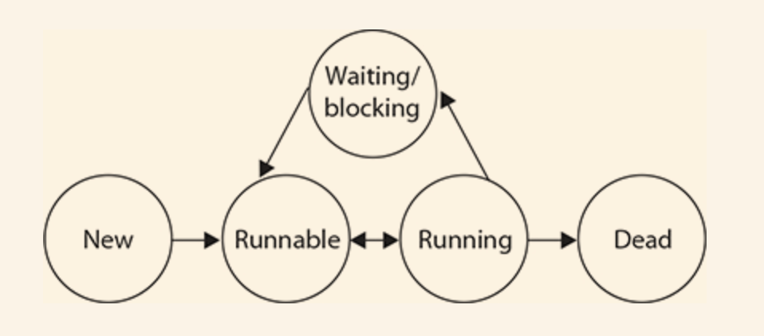

# Concurrency
[Cheat Sheet](./CheatSheet.md)

## Some Learning Notes ##

### Threads ###
* A **thread** is the smallest unit of execution that can be scheduled by OS.
* A **process** is a group of associated threads that execute in the same, shared environment.
* Threads in the same process share the same memory space and can communicate directly with one another.
* Static:  
  If one thread updates the value of a static object, then this information is immediately available for other threads **within the process** to read.
* A **task** is a single unit of work performed by a thread.  
  A task will commonly be implemented as a lambda expression.  
  A thread can complete multiple independent tasks but only one task at a time.

&nbsp;

### Thread Types ###
* A system thread is created by the JVM and runs in the background of the application.  
  E.g: garbage-collection thread
* User-defined thread

* **User threads** are high-priority threads. The JVM will wait for any user thread to complete its task before terminating it.
* A **daemon thread** is a thread that does not prevent the JVM from exiting when the program finishes but the thread is still running. 
* Daemon threads are low-priority threads. 
* An example for a daemon thread is the garbage collection. 
* Daemon threads are not recommended for I/O tasks. 

&nbsp;

### Concurrency ###
* The property of executing multiple threads and processes at the same time is referred to as **concurrency**. 
* When a thread’s allotted time is complete but the thread has not finished processing, a context switch occurs. 
* A context switch is the process of storing a thread’s current state and later restoring the state of the thread to continue execution. 
* Thread.MIN_PRIORITY : 1  
  Thread.NORM_PRIORITY : 5
  Thread.MAX_PRIORITY : 10
* By default, user-defined threads receive a thread priority value of Thread.NORM_PRIORITY.

&nbsp;

### Thread VS Runnable ###
* Both in `java.lang`
* **Functional Interface** Runnable
* **Class** Thread 
* Thread **implements** Runnable

* The Runnable interface should be implemented by any class   
  whose instances are intended to be executed by a thread.
* `thread.start()`  
  Causes this thread to begin execution, JVM calls the `run` method of this thread.
* `thread.run()`  
  If this thread was constructed using a separate Runnable run object, then that Runnable object's run method is called;   
  otherwise, this method does nothing and returns.  
  Subclasses of Thread should override this method.
  
* Constructor of Thread:   
  `Thread(Runnable target)`  
  run() method of target is invoked when this thread is started.

&nbsp;

### Creating a Thread ###
* Executing a task with Thread is a two-step process:  
  1. define the Thread with the corresponding task to be done
  2. start the task by using the `Thread.start()`

* Two ways to define a task:  
  1. Provide a `Runnable` object or lambda expression to the Thread constructor `Thread(Runnable target)`    
  2. Create a class that extends `Thread` and overrides the `run()` method.

* Two ways to define a task in short:
  1. **Implementing Runnable**
  2. **Extending Thread**  

* `thread.start()` vs `thread.run()`  
  `thread.run()` will not execute a task on a separate processing thread.   
  Instead, the thread that made the `run()` call will be used to execute the task.

* Which way to create a thread?   
  * In general, you should extend the Thread class only under very specific circumstances,   
  such as when you are creating your own priority-based thread.
  * In most situations, you should implement the Runnable interface rather than extend the Thread class.
  * Implementing Runnable is often a better object-oriented design practice since   
    it separates the task being performed from the Thread object performing it. 
  * Extending Thread does not allow you to extend any other class, whereas implementing Runnable lets you extend another class.

&nbsp;

### Polling with Sleep ###
* Polling is the process of intermittently checking data at **some fixed interval**.
* `Thread.sleep()` method requests **current** thread of execution to rest for a specified number of milliseconds. 

&nbsp;

### Little Summary ###
* `thread.start()` will start in a separate thread, and calls `thread.run()`, which calls `runnable.run()`
* Simply calling `thread.run()` will not start a separate thread.

&nbsp;

### ExecutorService ###
* Concurrency API: `java.util.concurrent`. 
* In Concurrency API, `ExecutorService` creates and manages threads for you.
* Recommended to use this framework anytime you need to create and execute a separate task, 
even if you need only a single thread.

&nbsp;

### ExecutorService, Executors, Executor ### 
* `Executors.newSingleThreadExecutor()` creates an `ExecutorService`. 
* `executorService.execute(Runnable)` executes a given task sometime in the future. 
* `execute` method takes in a Runnable lambda expression or instance and   
  completes the task **asynchronously**.
* Return type of `execute` is void ->   
  * it does not tell us anything about the result of the task
  * fire-and-forget
  * once it is submitted, the results are not directly available to the calling thread

* `interface Executor`
* `interface ExecutorService extends Executor`

&nbsp;

### Executors.newSingleThreadExecutor() ###
* `Executors.newSingleThreadExecutor()`:  
  - Creates an ExecutorService that uses a single worker thread.   
  - Tasks added are guaranteed to execute sequentially, and no more than one task will be active at any given time.
  - 2 threads running: main() thread and ExecutorService thread. 
  - ExecutorService thread will run the added tasks sequentially. 

&nbsp;

### Shutting Down a Thread Executor ###
* After using a thread executor, important to call the `shutdown()` method. 
* A thread executor creates a non-daemon thread on the first task that is executed, 
* failing to call shutdown() will result in your application never terminating. 
* ExecutorService life cycle:   
  - New Thread Executor
  - Active : Accepts New Tasks, Executes Tasks
  - Shutting Down: Rejects New Tasks, Executes Tasks
  - Shutdown : Rejects New Tasks, No Tasks Running
* Calling `shutdown()` will transit into Shutting Down state. 
* Good practice to use try-finally to shut down ExecutorService.

&nbsp;

### Submitting Tasks ###
* In `ExecutorService`:  
  * `void execute(Runnable command)`
  * `Future<?> submit(Runnable task)`
  * `<T> Future<T> submit(Callable<T> task)`
* `execute()` supports only `Runnable`,   
  while `submit()` supports both `Runnable` and `Callable`.
* Therefore in practice, we prefer `submit()` over `execute()`,   
  even if we do not store the reference for the returned Future.   
  We recommend submit() over execute() whenever possible. 

&nbsp;

### Interface Future<V> ###
* where _V_ is the type of the result returned from the get method.
* Simply put, a Future represents the result of an asynchronous computation.

&nbsp;

### Atomic Operation ###
* operation carried out 
  * as a single unit of execution
  * without any interference by another thread

&nbsp;

### Thread states

* New: instance created, but the start() method has not been invoked. 
  * Not alive.
* Runnable: 
  * start() method invoked.
  * Eligible to be scheduled.
  * A thread can also return to this Runnable state after: 
    * Running, or,
    * coming back from blocked, or
    * waiting, or
    * sleeping
  * Alive
* Running: only one way to get to this state:  
  scheduler chooses a thread from the runnable pool
* 3 states not eligible to run (still alive) :
  * waiting: caused by code 
  * blocked: waiting for resource
  * sleeping: caused by code
  * They need to return to Runnable state first before Running
* Dead: when run() method completes

&nbsp;

### Thread.sleep()
* Just because a thread's sleep() expires and wakes up, does not mean it will return to running!  
  when a thread wakes up, it simply goes back to the **runnable** state. 
* The time specified in sleep() is the **minimum** duration in which the thread won't run,  
  but it is not the exact duration in which the thread won't run. 
* So cannot rely on the sleep() method to build a perfectly accurate timer. 

* sleep() is a **static** method  
  no thread can put another thread to sleep
* Thread.sleep() puts the currently running thread to sleep.

&nbsp;

### Thread.yield()
* a **static** method
* supposed to make the currently Running thread back to Runnable state,  
  to allow other threads of the same priority to get their turn.
* However, there is no guarantee that the yielding thread will not be chosen again over all others.
* Thread.yield() will not cause thread to go to waiting/blocked/sleeping state.

&nbsp;

### t.join()
* instance method
* t.join() means "join me to the end of t, so that t must finish before I can run again."

&nbsp;

### obj.wait()
* Object instance method
* when a thread executes the wait method of the target object,   
  the thread goes to the waiting list of the target object,  
  it does not execute any further instructions until the notify() method of the target object is called.
* obj.wait() means "put me to the waiting list of lock of obj".
* when the thread waits, it temporarily releases the lock for other threads to use   
  But it will need it again to continue execution.

&nbsp;

#### wait(), notify(), notifyAll() must be called from within a synchronized context,
a thread cannot invoke wait() or notify() on an object unless it owns the object's lock.
#### calling wait() will release the lock on the object immediately, 
#### calling notify() will not release the lock immediately. The thread still needs to exit from synchronized block to release the lock.
#### after a waiting thread receives the signal to wake up, it will wait until it can re-obtain ownership of the monitor and resumes execution. 

&nbsp;
----
### Useful links ###
* [What is the purpose of ScheduledFuture.get() method 
if is retrieved from the scheduleWithFixedDelay/scheduleAtFixedRate method](
https://stackoverflow.com/questions/25049021/what-is-the-purpose-of-scheduledfuture-get-method-if-is-retrieved-from-the-sch)
* OCP Java SE 8 Programmer II Exam Guide (Exam 1Z0-809) by Kathy Sierra, Bert Bates

